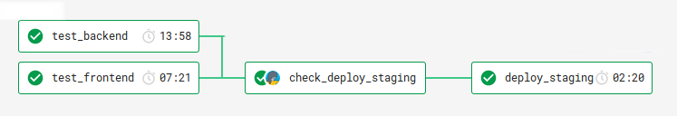

# Procurify CircleCI Build Pipeline

This is the main build pipeline for the procurifydevelopment repo. On each pull request the pipeline will run tests against the code and report the results in Github and Slack.

## Testing Changes Locally

If you are making changes to any of the stages locally, you can tests your changes using the [CircleCI CLI Tool](https://circleci.com/docs/2.0/local-cli/#quick-installation).

```bash
# Validate and compile (required for 2.1)
circleci config process .circleci/config.yml > .circleci/config-compiled.yml

# Execute a stage locally
circleci local execute -c .circleci/config-compiled.yml --job $JOB_NAME
```

## Pipeline


_*Diagram to be updated once the new steps are added_

### Checkout

#### Checkout Code

This is the checkout for the repository, the reason we do this in it's own job is to save us doing checkouts in each of the individual steps. Files from the initial checkout are then saved into a workspace that is mounted in the following steps.

We are using a shallow checkout to save time over doing a full checkout due to the size of the history on the repository.

#### Checkout React

**TEMPORARY:** We are eventually looking to replace this step completely so that the React code can be deployed separately from the backend image. But for now we are still pulling in the deploy branch of this repository and copying it into the image.

### Build Frontend and Test

#### Build Frontend

This step runs the compilation of the frontend Angular code. This generates the CSS files, then runs webpack to create the frontend bundles.

Note: this is unrelated to the React frontend code.

#### Test Frontend

Runs the javascript tests against the code on your PR/branch. Tests are required to pass on development before the build will be deployed to staging.

#### Test Backend

Runs the python integration tests against the code on your PR/branch. Also brings up supporting containers for the database and other dependencides.

_Note: If you require environment variables to run your tests make sure you add them to the job in `.circleci/config.yml`._

_Note 2: If you need to clean the cache and do a fresh pull for dependencies, use [no-cache] in your commit message (including square brackets)._

### AWS/ECR Build and Push Image

This step creates the image that will be deployed to Kubernetes then pushes the image to ECR for Kubernetes to be able to deploy.

### Deploy Branch

This deploys to a Kubernetes namespace based on your branch name.

### Test Branch (Upcoming)

We are looking to implement a small set of Smoke Tests to run against your branch once it's deployed to validate your code changes.

### Deploy Staging (Current)

This job just posts a curl request to `https://buildserver.procurify-staging.com/build` using the staging auth token.

If you ever need to update the token used here you can do so in the [CircleCI Environment Variables](https://circleci.com/gh/procurify/procurifydevelopment/edit#env-vars)

### Deploy Staging (Upcoming)

Once we are ready to switch the deployments over to Kubernetes from Rancher, we'll be changing the above step to work like the Deploy Branch currently does.

## Caching

CircleCI uses caching to store your dependencies and re-use in a later build. The hash to generate the cache is from the checksum of either `package.json` for javascript, or a comination of `requirements/base.txt` and `requirements/development.txt` for python.

See: [CircleCI Caching](https://circleci.com/docs/2.0/caching/)

## Test Results

To view the test results over time you can use the [Insights](https://circleci.com/build-insights/gh/procurify/procurifydevelopment/development) tab in CircleCI. Any tests that can output junit.xml can be saved in CircleCI using the `store_test_results` option.

See: [CircleCI Test Metadata](https://circleci.com/docs/2.0/collect-test-data/)

## Work in Progress

- Shallow clone
- Test Splitting for backend tests
- Staging Deployments to Kubernetes
- UI Smoke Tests from Testim and Puppeteer
